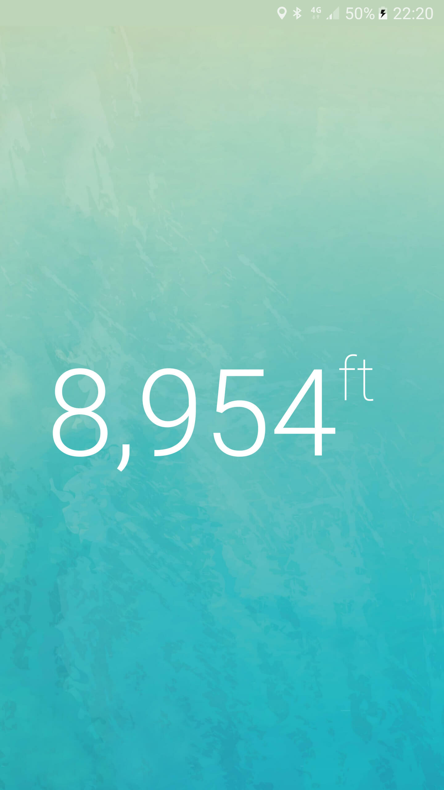

# Apex Elevation
Apex Elevation - simple uncluttered elevation app using GPS and Google's Elevation API, implemented with RxJava.

There is a bit of complexity surrounding retrieving the elevation on Android. The GPS elevation is [not very accurate](http://www.esri.com/news/arcuser/0703/geoid1of3.html), so [Google Maps' Elevation service](https://developers.google.com/maps/documentation/elevation/intro) is used when a network location is available. When the network is not available, the GPS location is used as a fallback. The app also detects when the location is stale or inaccurate, or when only the data network location is used rather than GPS, or when the location accuracy is low for any other reason.

All these scenarios complexity is something the user should not need to worry about. The idea is that all they see is their height in metres (or feet for US-based users) above the sea level as accurate as it can get. Although some subtle cues are displayed if the location is inaccurate for whatever reason.

[Download link via Google Play](https://play.google.com/store/apps/details?id=io.github.ktchernov.simpleelevation)

# LICENSE

Apache 2.0, see [LICENSE.md](LICENSE.md) for full details.
